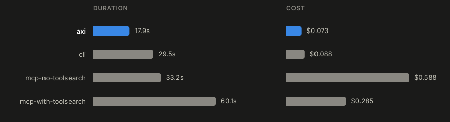

# bench-aws

A benchmark that compares three ways an AI agent can talk to AWS: the raw
`aws` CLI, the [`aws-axi`](https://github.com/thatdudealso/aws-axi) wrapper,
and the hosted [AWS MCP server](https://github.com/awslabs/mcp).

## Conditions

| Condition             | Interface      | How the agent reaches AWS                                              |
| ---------------------- | --------------- | ------------------------------------------------------------------------ |
| `cli`                   | `aws` CLI       | Baseline. Plain shell commands.                                          |
| `axi`                   | `aws-axi`       | Compact TOON-style output with pre-computed summaries.                   |
| `mcp-with-toolsearch`   | AWS MCP server  | Tools are found via ToolSearch, then called.                             |
| `mcp-no-toolsearch`     | AWS MCP server  | All tool schemas load upfront; ToolSearch is disabled.                   |

## Benchmark Results

One of the tests we ran was `count_lambda_functions`:

> How many Lambda functions are deployed in the default region? Report the
> exact total.

All four conditions returned the correct total. What differed was speed and cost.

`axi` won both, finishing in 3 turns on 72K input tokens.
